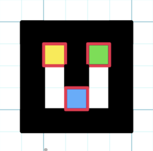
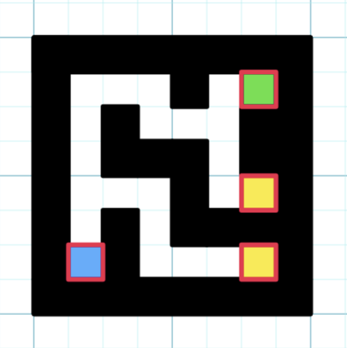
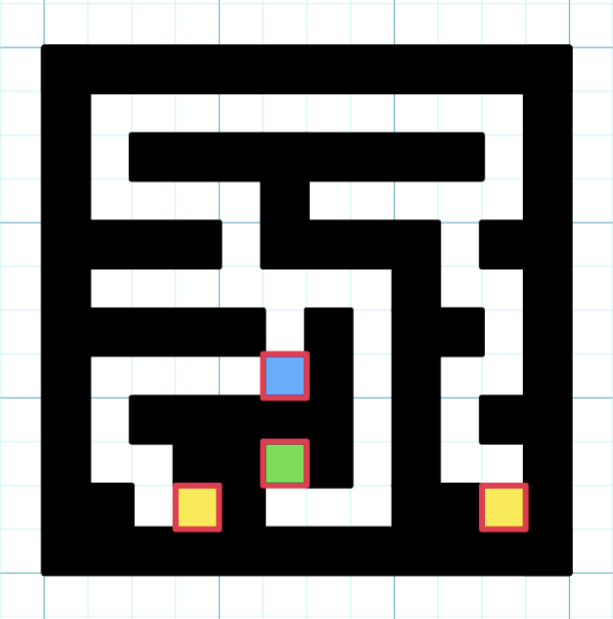
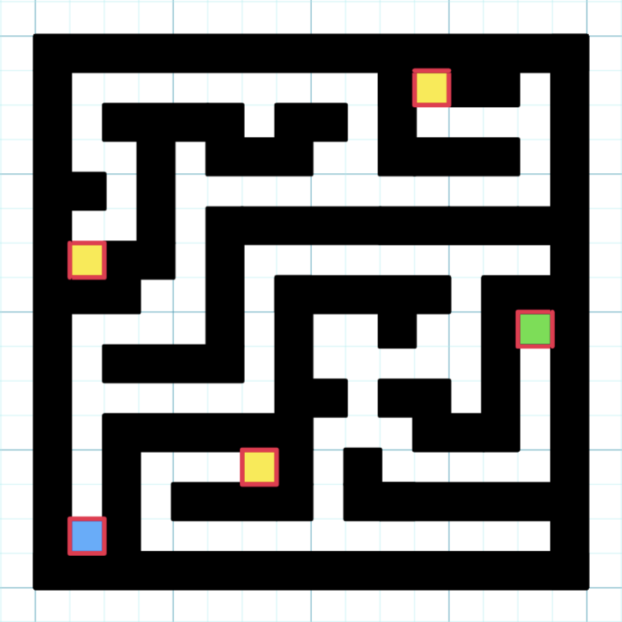

# Maze Game: CSCI 136 Final Project
*Ward Prize Nominated!*

By: Vincent Hernandez and Minseo Kim


## Game Overview 
This is a first person game where the player is trapped in a maze. They must collect keys and find their way though multiple levels befoe the time runs out.
### Gameplay

The player uses the arrow keys to look around and WASD to move through the maze. They player has to collect keys throughout the maze, before reaching its exit. There is a timer, and if the player does not escape all four mazes before the time runs out, they lose. 

### Features
- 3D rendering engine
- Triangle Culling
- Simple, Custom World Generation
- Wall/Entity Collision
- Random World Generation

### Mazes

The Mazes ramp up in difficluty, with the "0th" maze being a tutorial, getting the user familiar with the keys and exits. The mazes get progressivly larger, more difficult, and there are more keys to find, in order to escape. Once the player completes all four mazes, they will race to complete the most amount of randomly generated mazes in the remaining time to earn a higher score beyond winning.  

<details>
  <summary>SPOILER WARNING: Maze Layouts Below!</summary>

#### KEY: 

- Blue: Spawnpoint
- Yellow: Key
- Green: Exit
#### Maze 0



#### Maze 1



#### Maze 2



#### Maze 3



</details>

## Final Requirements

We utilized a Binary Heap to effectively implement a Priority Queue, which we use when rendering triangles to cull unseen shapes. We have methods such has sorting up and down, inserting, and polling elements. We also use ArrayLists throughout the game as a convient way of storing data. 

## Compiling and Executing 

Before you compile and run this program, make sure you are in the same directory this `README.md` lives in on your terminal. To check, run `pwd` on the Terminal. You should see something like (although not the same as)

```
/CS136/mazegame
``` 

First, make a bin directory where Java will store and read the .class files.

```
mkdir bin
```

Then run the following command to compile your programs 

```
javac -d bin mazegame/*.java
```

Run the following command to execute: 

```
java -cp bin mazegame.main
```

If using WSL(And maybe Linux) run the following command in the terminal before launch:
```
export DISPLAY=:0
```

If Using Windows you may need to use one of the follwing arguments 
- -1: Doubles Frame Rate(Frame rate should be ~60)
- -2: Removes Unicode Charecters
- -3: Does both